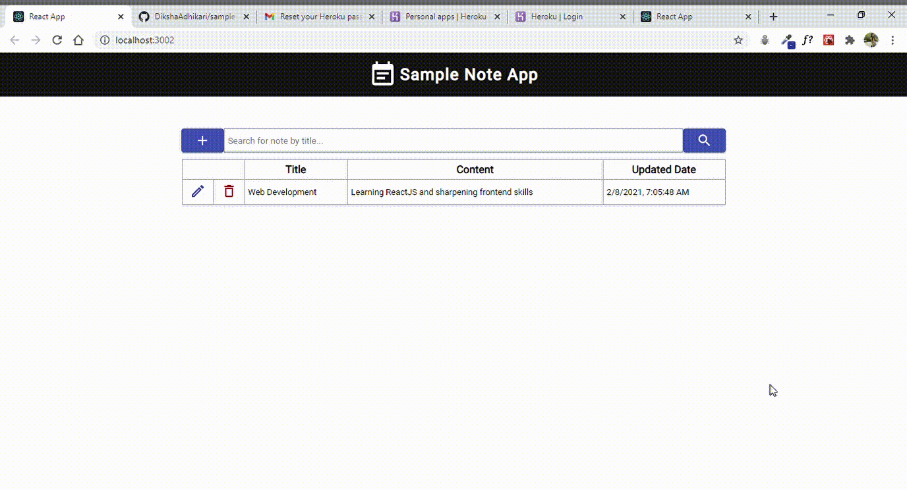

# Getting Started with Sample Note App 

This project makes use of the frontend and lets you create and delete notes. The features that it has are:
1.  *Add a note*
2.  *Edit a note*
3.  *Remove a note*
4.  *Find note by title search filter*
5.  *List all the notes*

The app is made responsive and has an optimal layout.

### Demo

### Deployment

The project is deployed via *heroku*.

